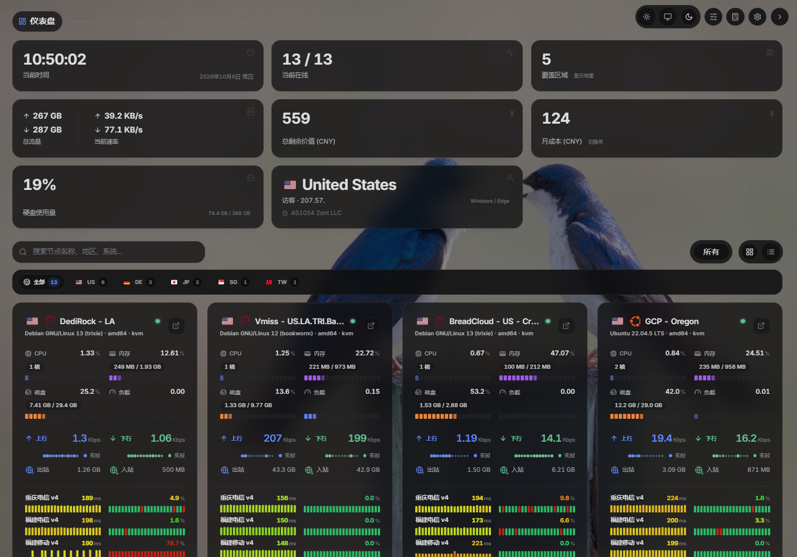
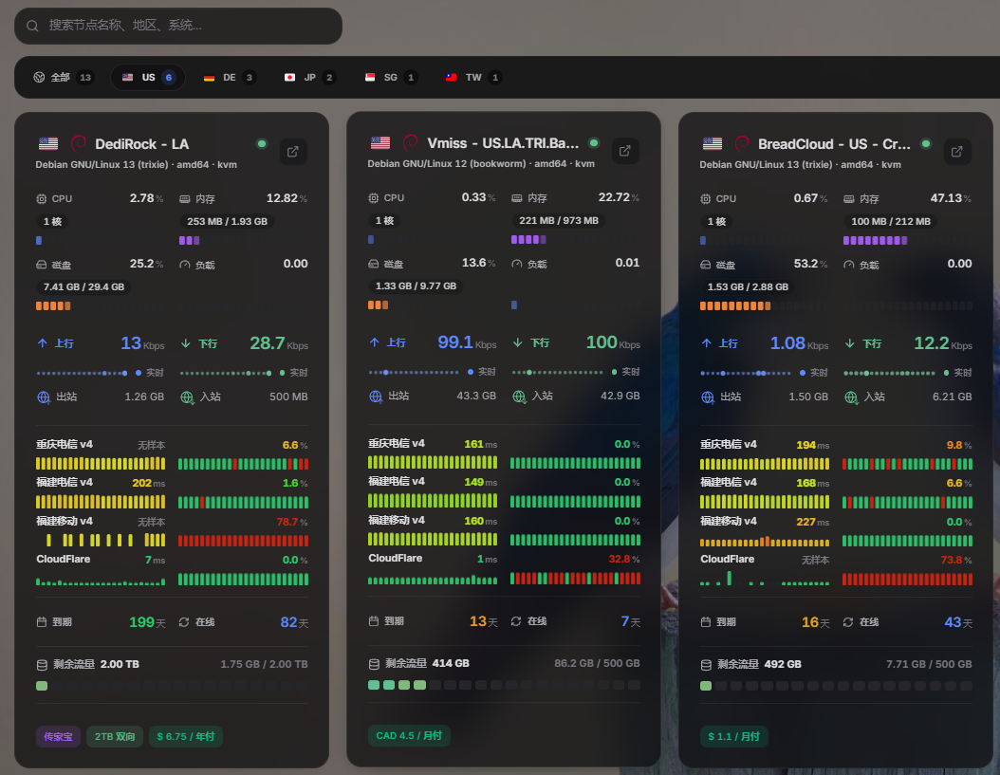
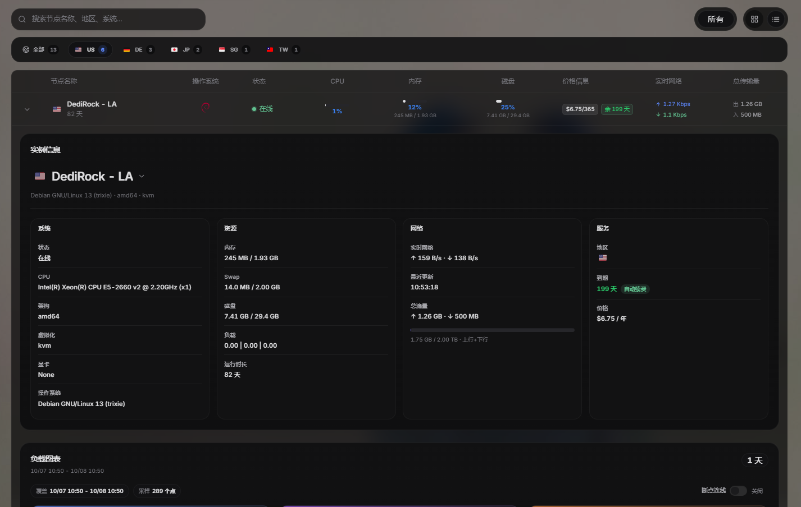
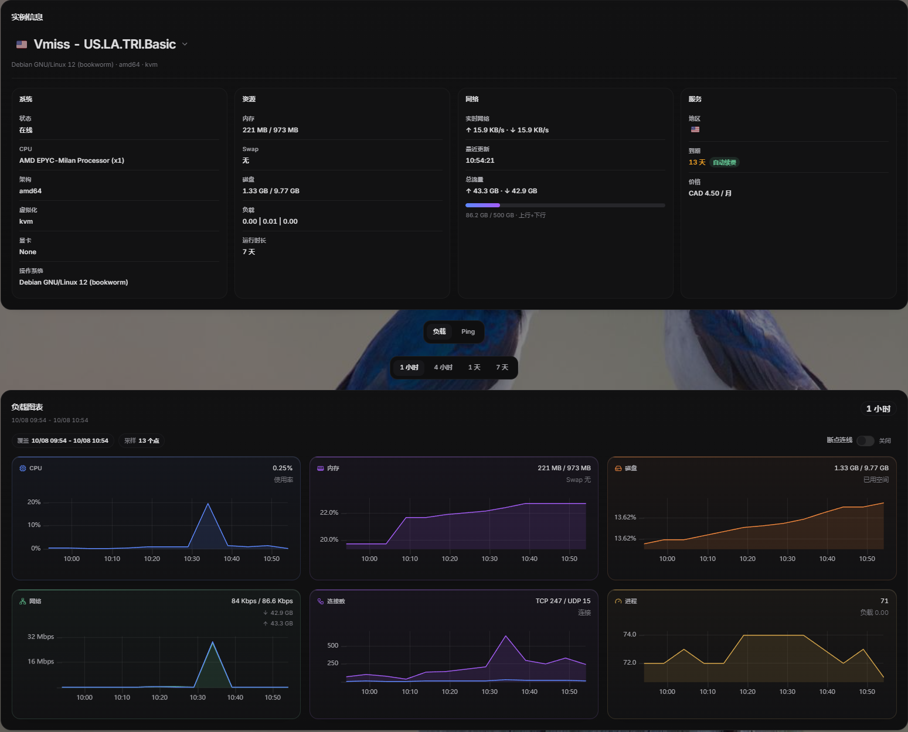
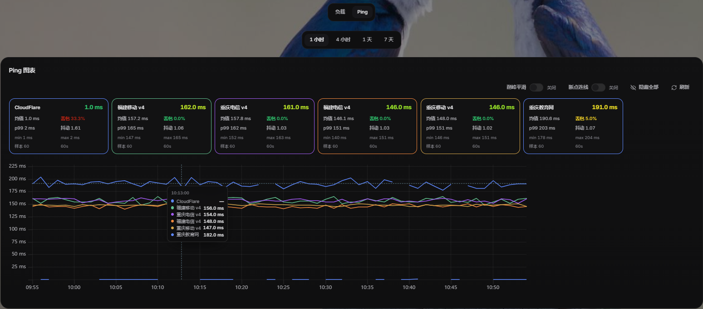
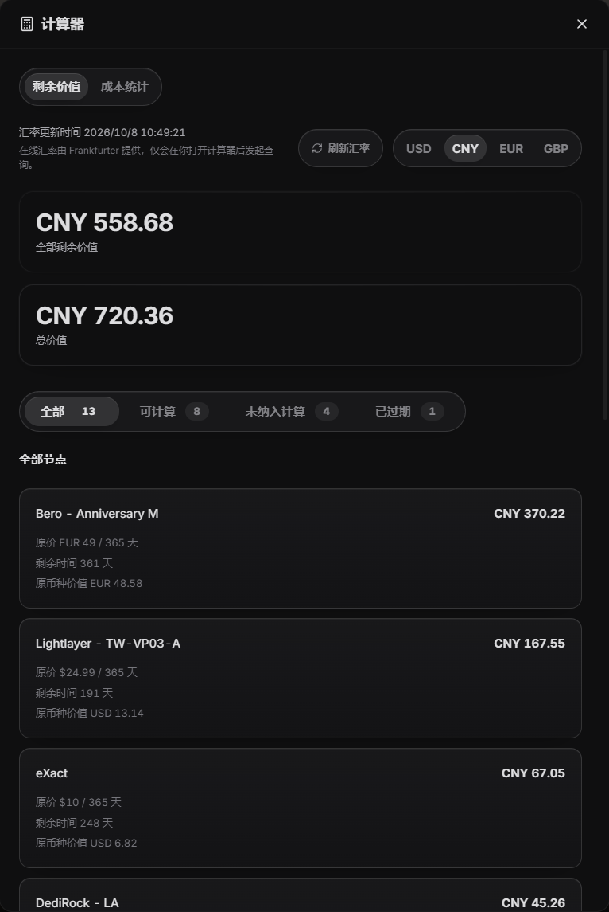
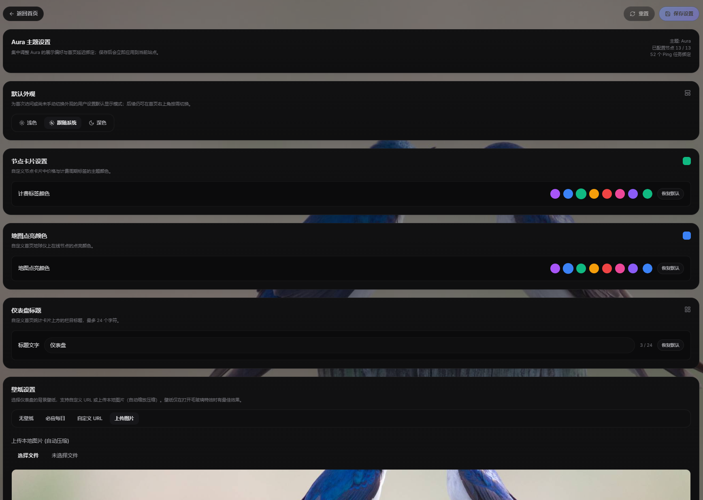
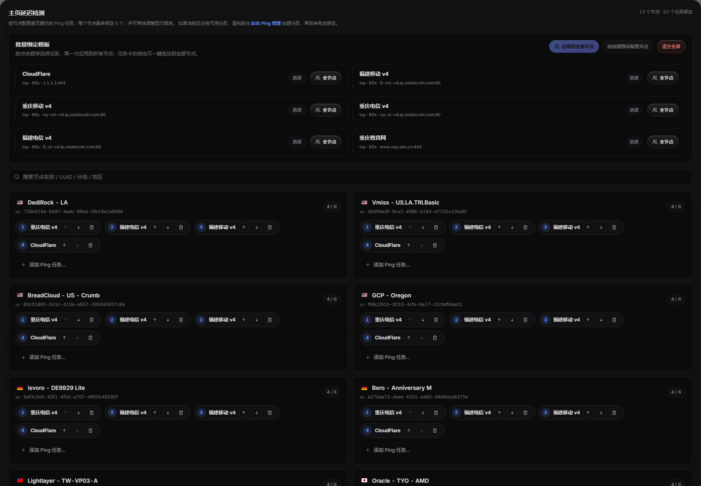

<div align="center">
  <h1>Komari Theme: Aura</h1>
  <p>一款为 <a href="https://github.com/komari-monitor/komari">Komari Monitor</a> 打造的现代化探针监控主题。</p>

  <p>
    
    
    
  </p>
</div>

Aura 为日常服务器监控提供仪表盘、地区筛选、多任务 Ping、历史图表和剩余价值统计，支持浅色、深色及自定义壁纸。首页快速查看节点状态，详情页进一步查看资源、网络和服务信息。

## 主要功能

- **仪表盘**：当前时间、在线节点数、覆盖区域、总流量、网络速率、磁盘用量及剩余价值与成本统计；栏目标题可自定义。
- **地区与分组筛选**：按节点名称、地区和操作系统搜索，结合分组和地区按钮筛选；地区按钮展示节点数量，并按数量从多到少排列。
- **节点卡片与表格**：卡片展示资源、实时网络、到期和流量额度；桌面端可切换表格视图，并展开节点信息与负载图表。
- **多任务延迟检测**：每个节点最多展示 6 个 Ping 任务，包含延迟、丢包率和历史分段条；任务数量不同的卡片也会预留对齐空间。
- **节点详情与历史图表**：下拉切换服务器，查看系统、资源、网络和服务信息；负载与 Ping 可选择 1 小时、4 小时、1 天、7 天范围。
- **Ping 统计**：查看均值、p99、丢包率、最小/最大延迟及样本数，支持隐藏任务、削峰平滑和断点连线；断点连线默认关闭。
- **剩余价值计算器**：查看剩余价值与成本统计，按节点状态筛选并进行多币种换算。
- **主题外观与设置**：浅色、深色、跟随系统；管理员可设置默认外观、仪表盘标题、计费标签颜色、地图点亮颜色、自定义 URL 或上传壁纸，以及壁纸和卡片不透明度。
- **批量 Ping 配置**：按选择顺序生成绑定模板，一键应用到全部节点或未配置节点；也可向所有节点追加任务，并对单个节点调整显示顺序。

## 预览截图

以下截图展示深色模式与自定义壁纸下的 Aura。



<details>
<summary>节点卡片、地区筛选与表格视图</summary>

地区按钮按节点数量排列，卡片展示资源、多个 Ping 任务、到期和剩余流量。



表格支持展开节点，直接查看系统、资源、网络和服务信息。



</details>

<details>
<summary>节点详情、负载与 Ping 图表</summary>

通过节点名称下拉切换服务器，查看实例信息和六类资源历史图表。



Ping 页面展示多任务延迟曲线、丢包和样本统计，并提供悬停提示及图表控制。



</details>

<details>
<summary>剩余价值计算器</summary>

按币种和节点状态查看剩余价值、总价值及节点明细，也可切换成本统计。



</details>

<details>
<summary>主题设置与批量 Ping 绑定</summary>

管理员可调整默认外观、计费标签和地图颜色、仪表盘标题及壁纸。



批量配置首页 Ping 展示任务，并对每个节点单独添加、移除和排序。



</details>

## 安装与使用

1. 打开本仓库的 [Releases 页面](https://github.com/km-hl/komari-theme-aura/releases)。
2. 下载对应版本的 `Aura-vX.Y.Z.zip` 主题包。
3. 登录 Komari 管理后台，在主题管理页面上传 ZIP 并启用 Aura。
4. 返回首页查看节点；登录后，右上角快捷按钮会提供“主题设置”入口。

### 配置首页 Ping

1. 先在 Komari 后台的 Ping 管理中创建任务，并确认任务已关联需要检测的节点。
2. 打开 Aura“主题设置 → 主页延迟检测”，按希望展示的顺序选择任务。
3. 将模板应用到全部节点或未配置节点，也可以单独为节点添加、删除和排序任务；每个节点最多展示 6 个。
4. 点击“保存设置”，首页即可按配置展示。主题中的绑定用于控制展示，不会创建后台检测任务。

### 查看历史与流量

点击节点名称进入详情页，可通过顶部节点名称的下拉菜单切换服务器。历史范围最多 7 天；可选范围会结合主控返回的记录保留时长调整，实际曲线只展示后端已有记录，选择 7 天不会补齐缺失数据。

流量额度使用后台设置的 `traffic_limit` 和计费方式计算，支持上行、下行、上下行合计及较大/较小值。未设置额度时，首页显示无限额度；累计流量取自探针上报。

右上角外观按钮用于切换浅色、深色或跟随系统；计算器按钮打开剩余价值统计。管理员保存的主题设置会应用到站点，访客手动选择的外观优先于默认外观。

## 本地开发

使用 Node.js 22 和 npm，与仓库发布流程保持一致。本地前端需要连接一个已有的 Komari 主控。

安装依赖：

```sh
npm ci --legacy-peer-deps
```

如需让本地主题直接访问线上或 VPS 上的 Komari 后端，可以在项目根目录创建 `.env.local`：

```env
VITE_KOMARI_PROXY_TARGET=https://your-komari.example.com
```

启动开发服务：

```sh
npm run dev -- --host 127.0.0.1
```

默认访问地址为 `http://127.0.0.1:5173/`。修改 `.env.local` 后需要重启开发服务；未配置代理目标时，默认连接 `http://localhost:25774`。

需要测试主题设置时，在本地访问 `/dev-login`，使用代理目标主控的管理员账号登录，再进入 `/?view=theme-manage`。本地与线上域名的登录状态独立；在本地保存主题设置也会修改所连接主控的设置。

检查与打包：

```sh
npm run lint
npm run build
npm run package
```

Windows PowerShell 如果无法执行 `npm`，可改用 `npm.cmd`，例如 `npm.cmd run dev -- --host 127.0.0.1`。

`npm run package` 使用已有的 `dist/`，请先完成构建。生成的 `Aura-vX.Y.Z.zip` 包含 `komari-theme.json`、`preview.png` 和 `dist/`，版本号取自主题配置文件。

### 常见问题

- **本地没有节点数据**：确认代理目标地址正确、主控可访问且 Agent 正常上报；修改代理配置后重启 Vite。
- **无法进入主题设置**：确认当前访问域名下已登录管理员；本地开发使用 `/dev-login` 登录。
- **提示实时状态同步异常**：检查主控和反向代理的 WebSocket 连接。提示出现时页面可能展示最近缓存，不能据此判断节点已离线。
- **历史不足或没有 Ping 曲线**：检查主控的记录开关、保留时长、任务与节点关联，以及任务是否已有样本；主题不会生成不存在的历史记录。

## 致谢

Aura 基于社区主题 Lumina 的思路继续演进，并针对 Komari 的现代监控场景重构了仪表盘、筛选、图表、主题设置和多项交互细节。感谢 Komari 与相关开源项目提供的基础能力。
